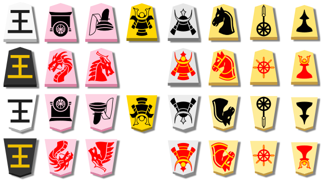

# ShogiGUI-piece-sets
## All types of sets are included:

#### The sets are scaled 5/8 the size of physical pieces. Increase by 60% to get the size of physical pieces.
Made with Inkscape a free vector graphics software.
Also boards and piece stand.
The SVG folder contains the sets but in SVG format so you can make your own custom sets and share them please.
The PNG folder contains all mentioned above in picture format.

#### Credit: Kanji P and International pieces were made by CouchTomato, but I made them 3D, arranged and edited them onto the ShogiGUI format so enjoy. :)
#### Pieces designed by Ka-Hu https://github.com/Ka-hu/shogi-pieces
#### 2-kanji set https://github.com/orangain/shogi-piece-images
#### Wood Textures https://unsplash.com/s/photos/wood-texture https://www.pexels.com/
#### Nameless & mohumohumouhu http://toro.2ch.sc/test/read.cgi/bgame/1572078063
#### Valdivia https://github.com/kleffa/ValdiviaShogiPieces
This repository contains CouchTomato's old wood pieces that are unfilled and the lance is also different. https://github.com/CouchTomato87/InternationalizedPieces

Pieces designed by peanatsu https://github.com/peanatsu/shogi_printout/releases

Various types of pieces https://github.com/yagu0/vchess

http://shineleckoma.web.fc2.com/index.html
